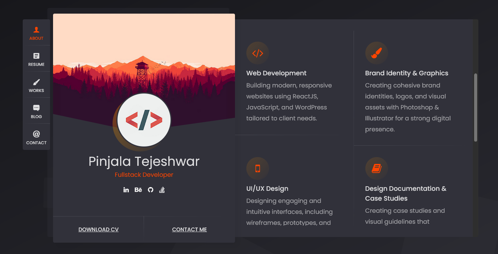

# 💼 Tejeshwar’s Web Portfolio

Welcome to my personal portfolio website — a showcase of my projects, skills, and experience as a developer.  
Built to reflect my work and passion for creating beautiful, functional, and performant web applications.

---

## 🚀 Live Demo

🌐 [Visit the live site here](https://tejeshwarwebportfolio.vercel.app/)

---

## 📸 Preview

This is my personal portfolio website, built using a **headless WordPress template** as the foundation, with significant customizations to better reflect my style and goals.  

I modified and enhanced the template extensively — making design adjustments, tweaking layouts, optimizing responsiveness, and updating content structure — to create a polished, unique portfolio that showcases my skills and projects effectively.

---

## ✨ Features

✅ Fully responsive design (works across devices)  
✅ Built with modern web technologies  
✅ Highlights projects, skills, and contact information  
✅ Deployed on [Vercel](https://vercel.com)

---

## 🛠 Tech Stack

- **Frontend:** HTML, CSS, JQuery
- **Deployment:** [Vercel](https://vercel.com)
- **Version Control:** Git & GitHub

---